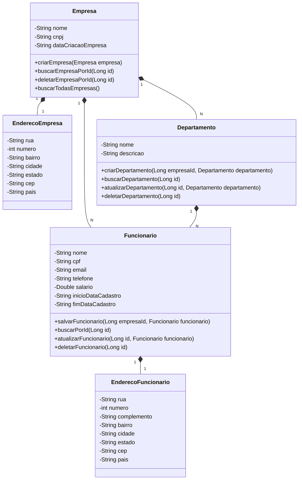

<h1 align="center">EMPRESAG</h1>

Projeto destinado a área empresarial - versão 1.0.0

## TECNOLOGIAS E FERRAMENTAS

## DIAGRAMA DE CLASSES

```mermaid
classDiagram
    class Empresa {
        -String nome
        -String cnpj
        -String dataCriacaoEmpresa
        +criarEmpresa(Empresa empresa)
        +buscarEmpresaPorId(Long id)
        +deletarEmpresaPorId(Long id)
        +buscarTodasEmpresas()
        
    }
    class EnderecoEmpresa {   
        -String rua
        -int numero
        -String bairro
        -String cidade
        -String estado
        -String cep
        -String pais
    }
    class Departamento {
        -String nome
        -String descricao
        +criarDepartamento(Long empresaId, Departamento departamento)
        +buscarDepartamento(Long id)
        +atualizarDepartamento(Long id, Departamento departamento)
        +deletarDepartamento(Long id)
    }
    class Funcionario {
        -String nome
        -String cpf
        -String email
        -String telefone
        -Double salario
        -String inicioDataCadastro
        -String fimDataCadastro
        +salvarFuncionario(Long empresaId, Funcionario funcionario)
        +buscarPorId(Long id)
        +atualizarFuncionario(Long id, Funcionario funcionario)
        +deletarFuncionario(Long id)    
    }
     class EnderecoFuncionario {   
        -String rua
        -int numero
        -String complemento
        -String bairro
        -String cidade
        -String estado
        -String cep
        -String pais
    }

    Empresa "1" *-- "1" EnderecoEmpresa
    Empresa "1" *-- "N" Departamento
    Empresa "1" *-- "N" Funcionario
    Departamento "1" *-- "N" Funcionario
    Funcionario "1" *-- "1" EnderecoFuncionario

```

          
          
          
          
