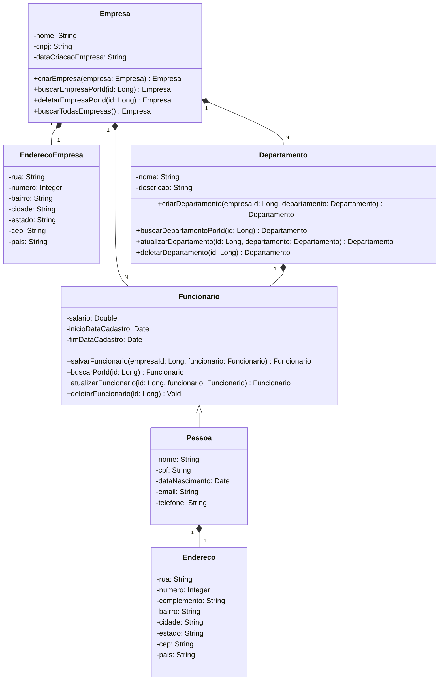

<h1 align="center">EMPRESAG</h1>
<p align="center">Projeto destinado a área empresarial - versão 1.1</p>


## TECNOLOGIAS E FERRAMENTAS


## 📂 Estrutura do Projeto
```
src/main/java/br/com/rhssolutions/empresaG
├── controller # Endpoints REST
├── client # Integração ViaCep
├── exceptions # Controle geral de exceções personalizadas
├── dto # DTOs
├── service # Interfaces de serviços
├── service/impl # Implementações de serviços
├── domain/model # Entidades do domínio
├── domain/repository # Interfaces de repositório (Spring Data)
├── doc # Configuração do Swagger/OpenAPI
└── EmpresaGApplication.java
```

### Passos
1. Clone o repositório:
```bash
git clone https://github.com/RafaSamm/empresaG.git
cd empresaG
```


2. Compile e rode a aplicação:
```bash
./mvnw spring-boot:run
```
ou, se preferir usar Maven instalado globalmente:
```bash
mvn spring-boot:run
```


3. Abra no navegador localmente:
```
http://localhost:8080
```
4. Abra no navegador a API em produção:
```
https://empresag-api.onrender.com/
```
## 📖 Documentação da API (Swagger)
Acesse a interface interativa do Swagger:
```
http://localhost:8080/swagger-ui/index.html
https://empresag-api.onrender.com/swagger-ui/index.html
```
### Principais endpoints
**Empresa**
- `GET /empresa/admin/todas` — lista todas as empresas em modo administrador (em atualização futura)
- `GET /empresa/pagina` - lista todas as empresas por paginação (eficiência)
- `GET /empresa/{id}` — busca por ID
- `POST /empresa/criar` — cria nova empresa
- `DELETE /empresa/{id}` — remove empresa

**Departamento**
- `GET /departamento/{id}` - buscar por ID
- `POST /departamento/criar/empresa/{empresaId}` - cria novo departamento em uma empresa já criada
- `PUT /departamento/atualizar/{id}` - atualiza o departamento
- `DELETE /departamento/{id}` - deleta departamento


**Funcionário**
- `GET /funcionario/{id}` - buscar por ID
- `POST /funcionario/cadastrar/empresa/{empresaId}` - cria novo funcionário em uma empresa já criada
- `PUT /funcionario/atualizar/{id}` - atualiza o funcionário da empresa
- `DELETE /funcionario/{id}` - deleta funcionário


## 🧪 Testes
Execute a suíte de testes (unitários e integração):
```bash
./mvnw test
```

## 🔧 Configurações
Arquivos de propriedades disponíveis:
- `application.properties` — configuração padrão (local)
- `application-dev.properties` — configuração para execução de testes
- `application-prod.properties` — configuração para produção
  
Por padrão, a aplicação pode usar H2 em memória para facilitar desenvolvimento e testes.


## DIAGRAMA DE CLASSES



          
          
          
          
